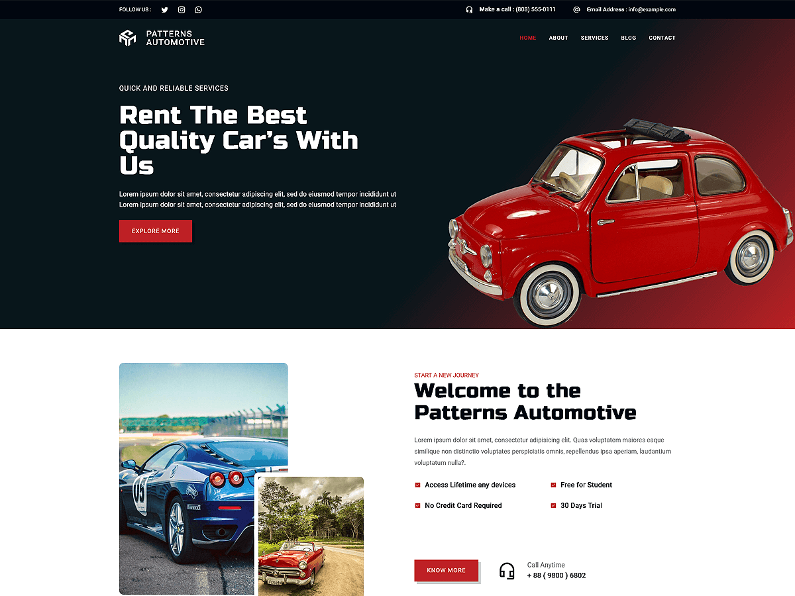

# Patterns Automotive

Patterns Automotive is a versatile WordPress theme designed for businesses in the automotive industry, offering a professional and customizable foundation for creating stunning websites. With full support for WordPress Full Site Editing (FSE), this theme allows users to effortlessly edit headers, footers, templates, and global styles. Featuring pre-designed patterns for vehicle listings, booking forms, services, and call-to-actions, Patterns Automotive is optimized for responsive design to ensure a seamless experience across devices. Perfect for car dealerships, motorcycle shops, RV rentals, and more, this theme combines flexibility with performance, making it easy to build a polished and functional website.

Primary color: `#be2026`.



## Features

- 3 hero and landing patterns
- 8 card layouts (card-1 through card-8)
- 1 service section pattern
- 5 archive/post-listing patterns
- Contact page pattern (page-contact)
- 1 menu navigation pattern
- 13 section layout patterns (featured sections and section titles)
- Full Site Editing (FSE) support
- Responsive design
- 68 block patterns + 15 templates + 11 template parts
- Automotive industry layouts (inventory, services, location)

## Requirements

- WordPress 6.6 or higher
- PHP 7.0 or higher
- Tested up to WordPress 6.7

## Development

This theme uses `@wordpress/scripts`:

```sh
npm install
npm run start    # dev mode with watch
npm run build    # production build
```

## License

GNU General Public License v2 or later.

This theme is based on [WP Block Theme Boilerplate](https://github.com/codersantosh/wp-block-theme-boilerplate), (C) 2025 Santosh Kunwar, [GPLv2 or later](https://www.gnu.org/licenses/gpl-2.0.html).
